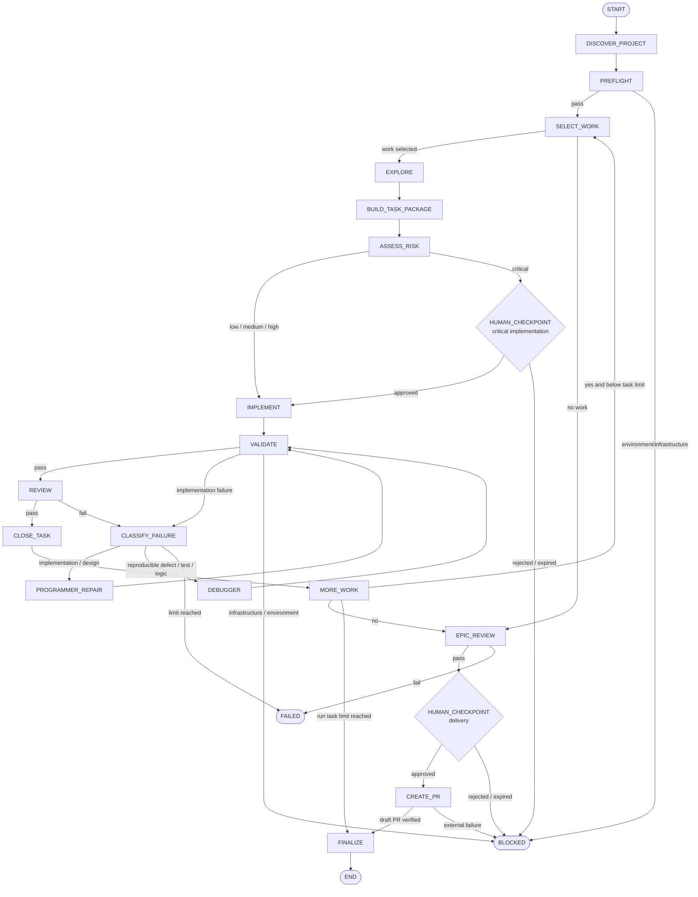

# Agent Graph Engine — V1 Architecture

Status: **FROZEN V1 — architecture only**

Document version: **1.0**

Freeze date: **2026-08-11**

Scope: architecture only; no implementation or cutover is authorized by this document.

## 1. Executive Summary

`agent-graph-engine` v1 będzie niezależnym, lokalnie uruchamianym silnikiem workflow dla agentów pracujących nad repozytoriami. Silnik nie będzie kopiowany do repozytorium użytkownika, nie będzie importował kodu projektu i nie będzie znał Spec Kit. Jedynym wymaganym tracked artefaktem integracyjnym może być mały `.agentgraph.yml`; stan wykonania będzie przechowywany pod `~/.agentgraph/`.

Rdzeniem rozwiązania będzie wersjonowany `GraphState`, jawny graf przejść oraz deterministic policy engine. Node zwraca ustrukturyzowany `NodeResult`, ale nie wskazuje następnego node'a. `GraphEngine` wybiera przejście na podstawie tabeli krawędzi, guardów, typu wyniku, polityki, liczników retry i checkpointów. Dzięki temu LLM nie kontroluje retry, kolejności pracy, limitów, commit/push/merge policy ani technicznego kończenia runu.

Spec Kit będzie pierwszym `WorkSourceAdapter`, Codex pierwszym `AgentProvider`, GitHub pierwszym `RemoteProvider`, a Python pierwszym wyspecjalizowanym `ProjectInspector`. Kontrakty pozostają jednak neutralne wobec tych implementacji. V1 obejmuje lokalne wykonanie, sekwencyjne write agents, recovery, semantic review, ograniczony repair loop, human checkpoints i utworzenie draft PR. Merge i deployment pozostają zabronione.

Najważniejsza zmiana względem obecnego autopilota to rozdzielenie trzech rzeczy, które są dziś splecione: (1) semantycznej pracy agentów, (2) deterministycznej orkiestracji i polityk, (3) projektowo-specyficznego źródła pracy. Obecny `spec_manager` nie przechodzi do v1 jako długowieczny agent-koordinator; jego mechaniczne obowiązki przejmuje graph engine, a rozumowanie semantyczne zostaje podzielone na małe, jawne role.

## 2. Current-State Findings

### 2.1 Zakres audytu

Audyt objął rzeczywisty kod i testy, w szczególności:

- `backend/app/tooling/local_autopilot/` wraz z `controller.py`, `models.py`, `milestone_pipeline.py`, `scope_proposal.py`, `ui.py` i entrypointami;
- `agent_task_preflight.py`, `agent_task_finalize.py`, `repository_checks.py`, `task_consistency.py`, `workstream_validation.py`, `epic_review_receipt.py`, `epic_close_evidence.py` i `git_hook_runner.py`;
- `.specify/autopilot.yml`, `.specify/workstreams/`, `.specify/runtime/` i format manifestów;
- `.codex/agents/*`, root `AGENTS.md`, `.githooks/*`, instalatory hooków i launchery autopilota;
- testy jednostkowe i hardening/E2E pod `backend/tests/unit/tooling/local_autopilot/` oraz testy preflight, finalize, receipts, workstreams i hooków.

### 2.2 Rzeczywisty przebieg obecnego systemu

Obecny autopilot ma dwa nałożone mechanizmy orkiestracji:

1. `EpicPipeline`/`MilestonePipeline` wybiera zakres, zarządza branchem, uruchamia zadania, required checks, receipts, push i draft PR oraz obsługuje cykl oczekiwania na merge i osobne closure PR.
2. `TaskPipeline` uruchamia `CodexAdapter`, który przekazuje prompt z poleceniem `$speckit-loop T###`. Wewnątrz tego jednego wywołania role `spec_manager`, `spec_explorer`, programmer, reviewer i ewentualny debugger wykonują semantyczny workflow. Zewnętrzny pipeline widzi tylko końcowy, uproszczony JSON.

Po powrocie Codex `TaskPipeline` odtwarza `tasks.md`, sprawdza scope drift, uruchamia walidację i finalizer, sam zapisuje receipt jako `review_verdict=PASS`, zamyka checkbox, stage'uje allowlistę, uruchamia hook i commit. Oznacza to, że semantic review istnieje, ale nie jest pierwszoklasowym stanem z osobnym kontraktem w autopilocie. V1 musi wyeliminować tę niejawność.

### 2.3 Klasyfikacja zachowań

| Kategoria | Ustalenia z kodu |
|---|---|
| Uniwersalne | bezpieczny process runner bez shella, timeout/cancellation, zabijanie drzewa procesów, redakcja sekretów, Git status/baseline, allowlisty, scope-drift detection, atomic JSON writes, receipts związane z SHA, idempotentne wyszukiwanie PR, recovery i archiwizacja |
| Specyficzne dla repo | `ROOT = parents[...]`, Python 3.11, `agent.python`, `master`, pełny `pytest`, Tkinter UI, konkretne launchery, branch/commit naming, `specs/001-ai-content-studio`, lokalny Linux CI, polityki projektu z `AGENTS.md` |
| Specyficzne dla Spec Kit | ID `M###/E###/T###`, `tasks.md` i checkboxy, `spec.md/plan.md/...`, `.specify/workstreams`, `active-epic`, manifest status, hierarchy milestone→epic→task, task metadata parser i consistency checks |
| Deterministic orchestration | selection order, dependency readiness, branch/active-scope guard, state transitions, baseline comparison, limit zadań, timeout, retry limit, allowlist enforcement, validation ordering, receipt freshness, push/PR gates, terminal status |
| Wymaga LLM | eksploracja zależności w realnym kodzie, scoping/task package, ocena ryzyka, implementacja, semantic review, klasyfikacja niejednoznacznej porażki, naprawa/debugging |

### 2.4 Co można wykorzystać

Prawie bez zmian można przenieść algorytmy z `process_runner.py`: uruchamianie argv bez shella, limity wyjścia, heartbeat, redakcję, timeout, cancellation i terminowanie drzewa procesu. Konieczne są tylko neutralne nazwy, usunięcie Python/pytest-specific env defaults z core oraz przeniesienie katalogów tymczasowych do runtime engine'u.

Po adaptacji można wykorzystać lokalne operacje Git z `repository.py`, idempotentne operacje GitHub z `github_adapter.py`, atomic-write pattern ze `state_store.py`/receipts, porównanie baseline z finalizera, receipt freshness opartą o branch/HEAD/base SHA oraz recovery assessment z `recovery.py`.

Nową abstrakcją trzeba zastąpić pipeline'y task/epic/milestone, `TaskLifecycleState`, modele `AutopilotRun`, parsing workstreams w core, bezpośrednie wywołanie `$speckit-loop`, stan pod `.specify/runtime` i politykę rozproszoną między prompty, hooki, manifesty i Python.

Po udanym cutover z `ai-content-generation` powinny zniknąć lokalny autopilot, jego UI/launchery, orchestration-specific `.codex/agents`, `.specify/autopilot.yml`, autopilot-specific hook runner/hooki i aktywny runtime `.specify/runtime` związany z autopilotem. Historyczne receipts należy zarchiwizować przed usunięciem. Specyfikacje produktu, Spec Kit jako źródło pracy oraz projektowe zasady inżynierskie mogą pozostać.

### 2.5 Istotne problemy ujawnione przez audyt

- Ścieżki i feature są wielokrotnie hardcodowane (`specs/001-ai-content-studio`, `.specify/runtime`, `.specify/workstreams`).
- Stan runu, task state, task receipts, review receipts, validation receipts, baselines, push results, scope proposals i recovery backups mają osobne formaty i katalogi, bez jednego kanonicznego modelu transakcji.
- `AutopilotRun` ma zbyt mało danych do pełnego odtworzenia decyzji; część prawdy trzeba inferować z Git, `tasks.md` i kilku receipts.
- `TaskStateMachine` modeluje liniowy lifecycle zadania, ale nie pełny graf review/repair/checkpoint/delivery.
- Konfiguracja repo zawiera timeouts wykonawcze, które są lepszym globalnym defaultem engine'u. Jednocześnie polityki manifestów i `.specify/autopilot.yml` mogą być niespójne (np. automatyczny commit).
- Hooki wzmacniają bezpieczeństwo, ale importują lokalne moduły backendu; po odinstalowaniu projektu narzędziowego repo nie jest niezależne.
- Recovery jest wartościowe, lecz opiera się na przenoszeniu plików wewnątrz repo i specjalnych stanach terminalnych, zamiast na journalu node attempts.

## 3. Goals

1. Zamrozić implementowalny kontrakt jawnego grafu v1.
2. Oddzielić core engine od work source, rodzaju projektu, GitHub i providera LLM.
3. Utrzymać wszystkie decyzje bezpieczeństwa i przejścia w kodzie deterministic engine'u.
4. Zapewnić pełny, zewnętrzny runtime z resume i crash recovery.
5. Umożliwić Spec Kit w v1 bez importowania go do core.
6. Umożliwić pracę nad repozytorium, które nie zawiera kodu engine'u.
7. Zachować baseline-aware, allowlist-based wykonanie i niezależny semantic review.
8. Umożliwić etapową migrację i porównanie shadow bez zmiany obecnego autopilota przed cutover.

## 4. Non-Goals

- Implementacja engine'u w tym zadaniu.
- Refaktor lub zmiana zachowania obecnego autopilota.
- Kompatybilność binarna z obecnymi JSON receipts.
- Automatyczny merge, deployment lub autonomous release.
- Distributed execution, web dashboard, parallel write agents i multi-repo transactions.
- Uniwersalny parser każdego możliwego formatu backlogu w v1.
- Ukrywanie całej złożoności projektu za promptami.

## 5. Target Architecture

### 5.1 Warstwy

| Warstwa | Odpowiedzialność | Dozwolone zależności |
|---|---|---|
| `agentgraph.core` | GraphState, Node/NodeResult, edge table, policy evaluation, patch ownership, invariants | tylko standardowe/neutralne modele |
| `agentgraph.runtime` | store, journal, locks, receipts, checkpoints, recovery, GC, logs | core + filesystem abstractions |
| `agentgraph.execution` | process runner, scheduler, cancellation, write lock, evidence capture | core/runtime |
| `agentgraph.adapters.work` | SpecKitAdapter v1; przyszłe GitHub Issues/Markdown/Jira | publiczne kontrakty core |
| `agentgraph.inspectors` | Python, Node, Generic project inspection | process/Git contracts |
| `agentgraph.validation` | planowanie i wykonanie typowanych checks | inspector + process runner |
| `agentgraph.git` | lokalny GitAdapter | process runner |
| `agentgraph.remote` | GitHubRemoteProvider | Git identity + process/HTTP implementation |
| `agentgraph.agents` | AgentProvider i CodexProvider; prompt templates per semantic node | publiczne kontrakty, nigdy transition table jako instrukcja dla LLM |
| `agentgraph.app` | CLI, local approval UX, dependency wiring | wszystkie publiczne porty |

Core nie importuje żadnego adaptera. Composition root wybiera implementacje z `.agentgraph.yml`, global config i autodetekcji. Wszystkie adaptery zwracają neutralne DTO z `schema_version`, `capabilities` i `source_revision`.

### 5.2 Zasada wykonania

Każdy node działa na niezmiennym snapshotcie `GraphState` o numerze `state_version`. Zwraca `NodeResult` z patchem. Engine:

1. waliduje schemat rezultatu i uprawnienia do pól/plików;
2. zapisuje evidence i node-attempt receipt;
3. atomowo aplikuje patch przez compare-and-swap na `state_version`;
4. wybiera jedną krawędź według priorytetu i guardów;
5. zapisuje transition journal;
6. dopiero potem uruchamia następny node.

Node nie otrzymuje mutowalnego store i nie może sam uruchomić następnego node'a. Write-capable node otrzymuje dodatkowo lease wyłącznego writer locka i dokładną allowlistę.

## 6. Graph v1

### 6.1 Główny graf



`BLOCKED` i `FAILED` są terminalnymi statusami wykonania, ale oba przechodzą technicznie przez idempotentne `FINALIZE` podczas zamykania procesu. Diagram skraca tę operację dla czytelności. `CANCELLED` i nieodwracalny `TIMEOUT` również prowadzą do `FINALIZE`, nigdy bezpośrednio do kolejnego node'a.

### 6.2 Repair semantics

`repair_count` oznacza liczbę rozpoczętych napraw po pierwszym nieudanym `VALIDATE` lub `REVIEW`. Przed wejściem do `PROGRAMMER_REPAIR` albo `DEBUGGER` engine wykonuje atomic increment. Guard dopuszcza naprawę wyłącznie, gdy `repair_count < max_repair_cycles` przed inkrementacją. Po osiągnięciu limitu jedyną krawędzią jest `FAILED → FINALIZE`. LLM nie dostaje narzędzia do modyfikacji licznika ani polityki.

### 6.3 Zakres bez epica

`milestone`, `epic` i `task` są opcjonalnymi pozycjami hierarchii. Każdy adapter musi dostarczyć co najmniej neutralny `work_item`. Node o stabilnej nazwie `EPIC_REVIEW` oznacza w core **delivery-scope review**; gdy adapter nie ma epica, review obejmuje work items zakończone w bieżącym runie. Nazwa node'a jest zachowana w v1 dla jednoznacznego grafu, nie narzuca modelu danych adapterom.

## 7. GraphState Contract

### 7.1 Reguły ogólne

- Format persistence: JSON UTF-8, `schema_version=1`; modele w kodzie mają być ścisłe i odrzucać nieznane pola na granicach adapter/provider.
- `GraphState` jest snapshotem, nie event logiem. Pełna historia znajduje się w append-only transition journal i receipts.
- `required=conditional` oznacza, że model zawiera jawny guard opisany w kolumnie Notes; brak pola poza tym warunkiem jest poprawny.
- Patches używają operacji `set`, `append_unique`, `increment`, `merge_by_id` i `clear`; arbitralny JSON Merge Patch nie jest dozwolony.
- Wartości pochodzące od LLM są oznaczone `untrusted` do czasu walidacji deterministic node'em.

### 7.2 Kanoniczne pola i ownership

| Pole / grupa | Właściciel | Kto może zmieniać | Persistent | Required | Pochodzenie / reguła |
|---|---|---|---|---|---|
| `schema_version` | StateStore | migrator store | tak | zawsze | deterministic; dokładnie `1` |
| `state_version` | GraphEngine | GraphEngine CAS | tak | zawsze | deterministic, monotonic integer |
| `run.id`, `run.attempt`, `run.parent_run_id` | GraphEngine | START/recovery | tak | `id`, `attempt` zawsze | UUIDv7; attempt rośnie tylko przy resume/restart policy |
| `run.created_at`, `updated_at`, `started_by`, `mode` | GraphEngine | START/engine | tak | zawsze | deterministic UTC; mode `execute|read_only|shadow` |
| `run.status` | GraphEngine | transition executor/FINALIZE | tak | zawsze | `running|waiting_checkpoint|blocked|failed|cancelled|completed` |
| `repository.project_id` | ProjectRegistry | DISCOVER_PROJECT | tak | zawsze po discover | deterministic registry lookup |
| `repository.root`, `canonical_root` | ProjectRegistry | DISCOVER_PROJECT/rebind | tak | zawsze po discover | local discovery; absolutne ścieżki tylko w external runtime |
| `repository.remote.name`, `url`, `normalized_url`, `provider` | GitAdapter | DISCOVER_PROJECT/PREFLIGHT | tak | conditional: remote może nie istnieć | external deterministic; credentials zawsze usunięte |
| `repository.base_branch` | ConfigResolver | DISCOVER_PROJECT | tak | przed PREFLIGHT | config lub remote HEAD/autodetect |
| `repository.current_branch`, `head_sha`, `base_sha` | GitAdapter | PREFLIGHT, post-commit, delivery | tak | przed write node | external deterministic snapshot |
| `graph.current_node`, `previous_node`, `transition_seq` | GraphEngine | GraphEngine | tak | zawsze | deterministic; node nie może patchować |
| `graph.pending_resume_node` | GraphEngine | checkpoint/recovery | tak | conditional | ustawiany dla checkpointu lub recovery |
| `project.kind`, `runtimes`, `package_managers` | ProjectInspector | DISCOVER_PROJECT | tak | zawsze; generic fallback | deterministic/autodetect, wraz z confidence/provenance |
| `project.test_frameworks`, `linters`, `type_checkers`, `build_systems` | ProjectInspector | DISCOVER_PROJECT | tak | może być puste | deterministic inspection |
| `project.conventions` | ProjectInspector | DISCOVER_PROJECT | tak | zawsze | wykryte pliki, command sources, AGENTS/instructions references |
| `work.source.adapter`, `config`, `capabilities`, `source_revision` | WorkSourceAdapter | DISCOVER_PROJECT/PREFLIGHT | tak | zawsze | adapter; config bez sekretów |
| `work.milestone`, `work.epic`, `work.task` | WorkSourceAdapter | SELECT_WORK/CLOSE_TASK | tak | opcjonalne | adapter refs `{id,title,status,revision,metadata}` |
| `work.item` | WorkSourceAdapter | SELECT_WORK/CLOSE_TASK | tak | od SELECT_WORK do close | neutralny ref; jedyna obowiązkowa jednostka pracy |
| `work.completed_items` | GraphEngine + adapter evidence | CLOSE_TASK | tak | zawsze jako lista | append-only w runie |
| `work.dependencies` | WorkSourceAdapter | SELECT_WORK | tak | dla wybranego itemu | refs + status + evidence; może być puste |
| `task_package.id`, `work_item_revision`, `created_at` | GraphEngine | BUILD_TASK_PACKAGE acceptance | tak | przed ASSESS_RISK | deterministic envelope |
| `task_package.summary`, `context_refs`, `dependency_evidence` | PackageBuilder agent | BUILD_TASK_PACKAGE | tak | przed risk | LLM read-only, schema-validated |
| `requirements`, `acceptance_criteria` | Work adapter + PackageBuilder | SELECT_WORK/BUILD_TASK_PACKAGE | tak | kryteria nie mogą być puste przed IMPLEMENT | adapter facts plus LLM normalization; provenance per entry |
| `architecture_invariants` | Config/adapter/PackageBuilder | PREFLIGHT/BUILD_TASK_PACKAGE | tak | zawsze jako lista | project config and source docs; LLM may only add candidate entries, engine freezes set |
| `baseline.id`, `captured_at`, `branch`, `head_sha`, `status` | BaselineService | PREFLIGHT | tak | przed SELECT_WORK/write | deterministic |
| `baseline.paths.{tracked,staged,untracked,deleted,renamed}` | BaselineService | PREFLIGHT | tak | przed write | deterministic Git evidence |
| `scope.allowed_implementation_paths` | PackageBuilder | BUILD_TASK_PACKAGE then frozen by engine | tak | przed IMPLEMENT | LLM proposal; engine normalizes and freezes |
| `scope.allowed_test_paths` | PackageBuilder | BUILD_TASK_PACKAGE then frozen | tak | przed IMPLEMENT | LLM proposal |
| `scope.allowed_bookkeeping_paths` | WorkSourceAdapter | SELECT_WORK/BUILD_TASK_PACKAGE | tak | zawsze jako lista | adapter; write only via CLOSE_TASK |
| `scope.forbidden_paths` | PolicyEngine | PREFLIGHT/BUILD_TASK_PACKAGE | tak | zawsze | deterministic union of engine/project/adapter prohibitions |
| `risk.level`, `rationale`, `factors`, `assessed_at` | RiskAssessor agent + PolicyEngine | ASSESS_RISK | tak | przed IMPLEMENT | LLM semantic assessment; engine validates enum and minimum rules |
| `risk.programmer_route` | PolicyEngine | ASSESS_RISK | tak | przed IMPLEMENT | deterministic mapping: low/medium→fast, high/critical→high |
| `risk.human_checkpoint_required` | PolicyEngine | ASSESS_RISK | tak | przed IMPLEMENT | deterministic; critical zawsze `true` w v1 |
| `changes.observed_files` | GitAdapter | after every write node/VALIDATE | tak | po write | deterministic diff vs baseline |
| `changes.agent_reported_files` | AgentProvider | IMPLEMENT/repair | tak | po write | LLM/provider report, nie jest źródłem prawdy |
| `changes.scope_drift` | ScopeGuard | after every write node | tak | zawsze jako lista | deterministic; niepuste blokuje dalsze write |
| `validation.plan` | ValidationProvider | BUILD_TASK_PACKAGE/PREFLIGHT | tak | przed IMPLEMENT | typowane checks z provenance |
| `validation.attempts`, `latest_status`, `evidence_refs` | ValidationProvider | VALIDATE | tak | po VALIDATE | deterministic external results; append-only attempts |
| `review.attempts`, `latest_evidence_ref` | AgentProvider | REVIEW | tak | po REVIEW | LLM read-only structured evidence |
| `review.verdict`, `safe_to_close`, `issues` | Review result validator | REVIEW | tak | po REVIEW | LLM output, deterministic contract validation; `safe_to_close` tylko przy PASS |
| `repair.count` | GraphEngine | edge executor | tak | zawsze | deterministic, start `0` |
| `repair.max_cycles` | PolicyEngine | START | tak | zawsze | resolved config/default; immutable podczas runu |
| `repair.classification`, `history` | FailureClassifier + GraphEngine | CLASSIFY_FAILURE/edge executor | tak | conditional | LLM/deterministic classification; append-only history |
| `checkpoints[]` | CheckpointService | HUMAN_CHECKPOINT | tak | jako lista | human/external; id, kind, nonce hash, decision, actor, time, state_version, expiry |
| `commits[]` | GitAdapter | CLOSE_TASK/delivery operations | tak | jako lista | external deterministic; SHA, parents, message, work item, tree, policy receipt |
| `push.remote`, `branch`, `head_sha`, `status`, `attempts` | GitAdapter | CREATE_PR delivery substep | tak | conditional | external deterministic; no agent writes |
| `pull_request.provider`, `id`, `url`, `draft`, `state`, `head_sha`, `base` | RemoteProvider | CREATE_PR | tak | conditional | external verified response; draft musi być true w v1 |
| `failure.category`, `code`, `reason`, `node`, `evidence_refs` | GraphEngine | każdy node przez validated result; FINALIZE | tak | conditional | structured; category z zamkniętego enum |
| `cancellation.requested_at`, `requested_by`, `acknowledged_at` | GraphEngine | CLI/runtime | tak | conditional | deterministic/human request |

Żaden node LLM nie może patchować: `schema_version`, `state_version`, `graph.*`, `repair.count`, `repair.max_cycles`, `checkpoints`, `commits`, `push`, `pull_request`, `run.status` ani zamrożonych pól scope. Zmiana scope wymaga osobnego checkpoint proposal i nowego task package; w v1 kończy bieżący run jako `BLOCKED`, zamiast poszerzać allowlistę w locie.

## 8. Node Contract

```text
Node.run(state: GraphStateSnapshot, context: NodeContext) -> NodeResult
```

### 8.1 NodeContext

`NodeContext` zawiera wyłącznie capability-scoped zależności:

- `run_id`, `node_attempt_id`, `idempotency_key`, `deadline` i read-only `PolicySnapshot`;
- cancellation token;
- read-only lub write lease adekwatny do typu node'a;
- wybrane porty: `WorkSourceAdapter`, `ProjectInspector`, `ValidationProvider`, `GitAdapter`, `RemoteProvider`, `AgentProvider`;
- `EvidenceWriter`, `LogSink` i bezpieczny temp workspace pod `~/.agentgraph/`;
- dokładne dozwolone state patch paths i — dla write node — repository path allowlist.

Node nie dostaje bezpośredniego dostępu do StateStore, transition table, checkpoint store ani licznika retry.

### 8.2 Statusy i błędy

Dozwolone statusy wykonania node'a: `SUCCEEDED`, `FAILED`, `BLOCKED`, `CHECKPOINT_REQUIRED`, `CANCELLED`, `TIMED_OUT`. `FAILED` musi mieć `failure_category`: `implementation`, `design`, `validation`, `policy`, `contract`, `infrastructure`, `environment`, `external_service` albo `internal`.

Wyjątek nie jest kontraktem biznesowym. Runner przechwytuje wyjątek, redaguje dane, zapisuje evidence i tworzy `FAILED/internal` lub `FAILED/infrastructure`. Błąd schematu outputu providera to `FAILED/contract`, nie sygnał do automatycznego powtórzenia LLM.

### 8.3 Timeout i cancellation

- Każdy attempt ma skończony deadline; subprocessy dostają mniejszy z node timeout i pozostałego run deadline.
- Timeout kończy całe drzewo procesu i zwraca `TIMED_OUT`; brak automatycznego retry, chyba że konkretna edge policy jawnie go dopuszcza. V1 nie retry'uje timeoutów LLM ani validation.
- Cancellation jest cooperative przez token, a po grace period wymuszona przez process runner. Wynik `CANCELLED` prowadzi tylko do FINALIZE.
- Node, który wykonał częściowy external side effect, musi zwrócić lub pozostawić operation receipt umożliwiający reconcile.

### 8.4 Writes i idempotency

- `DETERMINISTIC` i `LLM_READ_ONLY` nie zapisują do repo.
- `LLM_WRITE` może zmieniać wyłącznie zamrożone implementation/test allowlist paths i działa pod wyłącznym writer lockiem.
- `EXTERNAL_OPERATION` może zapisywać tylko przez właściwy adapter; `CLOSE_TASK` ma osobną bookkeeping allowlistę, a Git/remote operations są policy-gated.
- Idempotency key ma postać `run_id:node_id:logical_attempt:state_version`. Provider i adapter zapisują go w receipts.
- Ponowne uruchomienie po crashu najpierw wywołuje `reconcile(idempotency_key)`. Node nie powtarza operacji, jeżeli trwały efekt jest już zgodny z oczekiwanym postcondition.

## 9. NodeResult Contract

Kanoniczny model v1:

```yaml
schema_version: 1
node_id: REVIEW
attempt_id: uuid
status: SUCCEEDED               # SUCCEEDED|FAILED|BLOCKED|CHECKPOINT_REQUIRED|CANCELLED|TIMED_OUT
reason:
  code: review_passed
  message: Human-readable, redacted summary
failure_category: null          # required for FAILED/TIMED_OUT when classifiable
state_patch:
  base_state_version: 17
  operations: []                # typed, ownership-checked operations
evidence:
  - id: ev_...
    kind: semantic_review
    uri: evidence/...
    sha256: ...
    producer: codex
    created_at: ...
    summary: ...
metrics:
  started_at: ...
  finished_at: ...
  duration_ms: 1234
  provider_usage: {}
external_effects: []            # operation id, type, status, reconcile data
checkpoint_request: null        # kind, prompt, state_version, expires_at; only when status is CHECKPOINT_REQUIRED
```

Reguły:

- `success`, `failure`, `blocked` i `checkpoint` są reprezentowane rozłącznym `status`, nie kombinacją booleanów.
- `reason.code` pochodzi z wersjonowanego enum; `message` nie steruje krawędziami.
- Evidence większe niż ustalony limit nie trafia do state; state przechowuje tylko referencję i digest.
- Patch z innym `base_state_version` jest odrzucany jako conflict i node nie jest automatycznie ponawiany.
- `external_effects` jest wymagane, jeżeli node wykonał zapis w Git, remote lub work source, także gdy końcowy status to failure.
- `CHECKPOINT_REQUIRED` nie zawiera decyzji człowieka. Decyzję zapisuje wyłącznie CheckpointService.

## 10. Transition Contract

### 10.1 Edge

```yaml
id: review_pass_to_close
from: REVIEW
to: CLOSE_TASK
priority: 100
condition:
  result_status: SUCCEEDED
  state_equals:
    review.verdict: PASS
    review.safe_to_close: true
guards:
  - no_scope_drift
  - baseline_compatible
  - required_validation_passed
retry_policy: none
checkpoint: none
terminal: false
```

`condition` dopasowuje wyłącznie typowane pola. `guard` jest czystą funkcją `Guard(GraphState, NodeResult, PolicySnapshot) -> GuardResult`. Krawędzie są oceniane malejąco po `priority`; dokładnie jedna musi pasować. Zero lub więcej niż jedna pasująca krawędź to `FAILED/internal_graph_ambiguity` i FINALIZE.

`retry_policy` może określać tylko engine-controlled retry i ma pola `counter`, `max`, `backoff`, `retryable_categories`. W repair loop używany jest `repair.count`; node result nie może oznaczyć siebie jako retryable w sposób omijający politykę. `checkpoint` określa kind i wymagane postcondition. Terminal transition ustawia `run.status`, zapisuje końcowy receipt i nie ma outgoing edge poza technicznym FINALIZE.

### 10.2 Pełna transition table v1

| # | From | Warunek wyniku/stanu | Guard / side effect engine'u | To |
|---:|---|---|---|---|
| 1 | START | state initialized | valid config, project lock acquired | DISCOVER_PROJECT |
| 2 | DISCOVER_PROJECT | SUCCEEDED | repo recognized, inspector + adapters resolved | PREFLIGHT |
| 3 | DISCOVER_PROJECT | FAILED/BLOCKED/TIMED_OUT | classify and persist | FINALIZE (blocked/failed) |
| 4 | PREFLIGHT | SUCCEEDED | baseline persisted, branch/head/source revision valid | SELECT_WORK |
| 5 | PREFLIGHT | infrastructure/environment/external failure | no write node started | FINALIZE (blocked) |
| 6 | PREFLIGHT | policy/contract failure | no write node started | FINALIZE (failed) |
| 7 | SELECT_WORK | SUCCEEDED + item exists | dependencies satisfied, run task limit not reached | EXPLORE |
| 8 | SELECT_WORK | SUCCEEDED + no item + completed_items nonempty | delivery scope resolved | EPIC_REVIEW |
| 9 | SELECT_WORK | SUCCEEDED + no item + completed_items empty | nothing to do | FINALIZE (completed/no-op) |
| 10 | SELECT_WORK | BLOCKED/FAILED | source revision/evidence persisted | FINALIZE |
| 11 | EXPLORE | SUCCEEDED | read-only evidence schema valid | BUILD_TASK_PACKAGE |
| 12 | EXPLORE | non-success | no repository writes | FINALIZE |
| 13 | BUILD_TASK_PACKAGE | SUCCEEDED | package complete; allowlists normalized/frozen; no baseline conflict | ASSESS_RISK |
| 14 | BUILD_TASK_PACKAGE | missing field/scope conflict | package rejected | FINALIZE (blocked/failed) |
| 15 | ASSESS_RISK | low/medium/high | deterministic route mapped | IMPLEMENT |
| 16 | ASSESS_RISK | critical | checkpoint required by immutable policy | HUMAN_CHECKPOINT(kind=critical_risk) |
| 17 | ASSESS_RISK | invalid/missing risk | route forbidden | FINALIZE (failed) |
| 18 | HUMAN_CHECKPOINT critical | approved for exact state_version/package digest | unexpired, actor recorded | IMPLEMENT |
| 19 | HUMAN_CHECKPOINT critical | rejected/expired | artifacts preserved | FINALIZE (blocked) |
| 20 | IMPLEMENT | SUCCEEDED | writer released; observed diff captured; no scope drift | VALIDATE |
| 21 | IMPLEMENT | BLOCKED or scope drift | no retry without new run/package | FINALIZE (blocked) |
| 22 | IMPLEMENT | FAILED implementation/design/validation | `repair.count < max` | CLASSIFY_FAILURE |
| 23 | IMPLEMENT | infrastructure/environment/timeout/cancel | no repair retry | FINALIZE |
| 24 | VALIDATE | all blocking checks PASS | evidence tied to diff/tree digest | REVIEW |
| 25 | VALIDATE | implementation/validation failure | `repair.count < max` | CLASSIFY_FAILURE |
| 26 | VALIDATE | implementation/validation failure | `repair.count >= max` | FINALIZE (failed) |
| 27 | VALIDATE | infrastructure/environment/timeout/cancel | no repair retry | FINALIZE (blocked/cancelled) |
| 28 | REVIEW | PASS + safe_to_close | validation evidence fresh, no drift | CLOSE_TASK |
| 29 | REVIEW | FAIL | `repair.count < max` | CLASSIFY_FAILURE |
| 30 | REVIEW | FAIL | `repair.count >= max` | FINALIZE (failed) |
| 31 | REVIEW | contract/infrastructure/timeout/cancel | no semantic retry | FINALIZE |
| 32 | CLASSIFY_FAILURE | programmer_repair | atomic increment repair.count; route retained | PROGRAMMER_REPAIR |
| 33 | CLASSIFY_FAILURE | debugger | atomic increment repair.count | DEBUGGER |
| 34 | CLASSIFY_FAILURE | blocked/ambiguous unsafe | no scope widening | FINALIZE (blocked) |
| 35 | CLASSIFY_FAILURE | any repair + limit reached | repair node not entered | FINALIZE (failed) |
| 36 | PROGRAMMER_REPAIR | SUCCEEDED + no drift | append repair history | VALIDATE |
| 37 | DEBUGGER | SUCCEEDED + no drift | append repair history | VALIDATE |
| 38 | repair node | non-success | no nested retry | FINALIZE |
| 39 | CLOSE_TASK | adapter close CAS succeeds; optional policy-controlled task commit verified | receipt binds work revision, tree and review | MORE_WORK |
| 40 | CLOSE_TASK | source revision conflict/external failure | do not infer closure | FINALIZE (blocked) |
| 41 | MORE_WORK | below max and adapter reports ready work | clear item-scoped state, preserve run evidence | SELECT_WORK |
| 42 | MORE_WORK | no more ready work | all completed items in delivery scope | EPIC_REVIEW |
| 43 | MORE_WORK | max_tasks_per_run reached | resumable terminal receipt | FINALIZE (completed/paused) |
| 44 | EPIC_REVIEW | PASS + safe_to_create_pr | required checks fresh, security/scope gates pass | HUMAN_CHECKPOINT(kind=delivery) |
| 45 | EPIC_REVIEW | FAIL/non-success | no PR side effect | FINALIZE (failed/blocked) |
| 46 | HUMAN_CHECKPOINT delivery | approved for head/tree/review digest | push and draft PR authorized, merge not authorized | CREATE_PR |
| 47 | HUMAN_CHECKPOINT delivery | rejected/expired | branch remains local | FINALIZE (blocked) |
| 48 | CREATE_PR | branch push reconciled and draft PR verified | idempotent by base/head; draft=true | FINALIZE (completed) |
| 49 | CREATE_PR | auth/network/service failure | operation receipt supports resume | FINALIZE (blocked) |
| 50 | any active node | CANCELLED | writer terminated/reconciled | FINALIZE (cancelled) |
| 51 | FINALIZE | terminal state receipt written, lock released | archive policy scheduled | END |

## 11. Node Catalog

| Node | Typ | Odpowiedzialność i wynik |
|---|---|---|
| START | DETERMINISTIC | resolve config/defaults, utwórz run, lock i policy snapshot |
| DISCOVER_PROJECT | DETERMINISTIC | rozpoznaj repo, project ID, Git remote, project inspector, adaptery i capability set |
| PREFLIGHT | DETERMINISTIC | sprawdź Git/source/policy/environment, przechwyć baseline, bez zmian w repo |
| SELECT_WORK | DETERMINISTIC | przez WorkSourceAdapter wybierz dependency-ready item; engine egzekwuje limity |
| EXPLORE | LLM_READ_ONLY | zbierz semantyczne evidence o kodzie, symbolach, testach i realnych zależnościach |
| BUILD_TASK_PACKAGE | LLM_READ_ONLY | zaproponuj kompletny bounded package, allowlisty, kryteria i validation plan; engine go zamraża |
| ASSESS_RISK | LLM_READ_ONLY | oceń ryzyko i uzasadnienie; engine wybiera route i checkpoint |
| HUMAN_CHECKPOINT | HUMAN_CHECKPOINT | pozyskaj i utrwal decyzję dla dokładnego state/package/head digest |
| IMPLEMENT | LLM_WRITE | wykonaj najmniejszą zmianę w implementation/test allowlist zgodnie z package |
| VALIDATE | DETERMINISTIC | wykonaj typowany ValidationPlan, scope guard i freshness checks |
| REVIEW | LLM_READ_ONLY | niezależny semantic review względem package, baseline, diff i validation evidence |
| CLASSIFY_FAILURE | LLM_READ_ONLY | sklasyfikuj niejednoznaczny failure; oczywiste klasy mogą być wstępnie wyznaczone deterministic rules |
| PROGRAMMER_REPAIR | LLM_WRITE | napraw brakujące/niepoprawne zachowanie lub design w niezmienionej allowliście |
| DEBUGGER | LLM_WRITE | odtwórz wskazany defect/test/logic failure i zastosuj minimalny fix |
| CLOSE_TASK | EXTERNAL_OPERATION | adapter CAS zamyka work item; opcjonalny engine-owned commit według policy; bez LLM |
| MORE_WORK | DETERMINISTIC | zlicz zadania, wyczyść item scope i wybierz ścieżkę loop/delivery |
| EPIC_REVIEW | LLM_READ_ONLY | review całego delivery scope, cross-task consistency, security, required checks evidence |
| CREATE_PR | EXTERNAL_OPERATION | policy-gated push reconcile i idempotentne utworzenie/odnalezienie draft PR |
| FINALIZE | DETERMINISTIC | terminal receipt, status, archive scheduling, lock release i jednoznaczne resume instructions |

`BLOCKED`, `FAILED`, `CANCELLED` i `END` są terminalnymi stanami grafu, nie wykonawcami semantycznymi.

## 12. Deterministic vs LLM Responsibilities

### 12.1 Minimalny zestaw ról LLM

1. **Explorer/Package Builder** — jedna read-only capability używana w dwóch node'ach z różnymi output schemas. Może być ten sam model/provider, lecz osobne invocations i receipts.
2. **Risk Assessor** — read-only; zwraca czynniki i rekomendowany poziom, nigdy route ani checkpoint policy.
3. **Programmer** — write; provider wybiera profil `fast` lub `high` wskazany przez engine.
4. **Reviewer** — niezależny read-only context, bez historii rozumowania programmera; używany dla task review i delivery review z osobnymi schemas.
5. **Failure Classifier/Debugger** — classifier jest read-only, debugger write. Provider może współdzielić model, ale capability i invocation są rozdzielone.

### 12.2 Los roli `spec_manager`

Osobny, długowieczny `spec_manager` nie jest potrzebny w v1. Jego obecne obowiązki dzielą się następująco:

| Obecny obowiązek managera | Właściciel v1 |
|---|---|
| wybór zadania i dependencies | WorkSourceAdapter + SELECT_WORK + deterministic guards |
| baseline i konflikt z dirty state | PREFLIGHT/BaselineService |
| kompletność package i allowlisty | BUILD_TASK_PACKAGE output + PackagePolicy validator |
| risk route/checkpoint | Risk Assessor dostarcza reasoning; PolicyEngine decyduje |
| handoff między rolami | GraphEngine i typowany state/evidence refs |
| retry count i failure routing | GraphEngine + CLASSIFY_FAILURE output |
| closure eligibility | REVIEW contract + CLOSE_TASK guards |
| zakończenie runu | FINALIZE |

Pozostaje semantyczne budowanie package i klasyfikacja failure, lecz są to małe node'y, a nie agent posiadający workflow. Prompt może opisywać zadanie node'a, ale nie zawiera transition logic.

## 13. Adapter Contracts

### 13.1 WorkSourceAdapter

```text
discover(repo, adapter_config) -> WorkSourceDescriptor
list_work(query, cursor?) -> WorkPage
get_work(work_item_ref) -> WorkItem
get_dependencies(work_item_ref) -> DependencySet
get_status(work_item_ref) -> VersionedWorkStatus
get_context(work_item_ref) -> WorkContextBundle
get_delivery_scope(work_item_ref | completed_items) -> DeliveryScope
mark_complete(work_item_ref, expected_revision, completion_evidence, idempotency_key) -> WorkMutationResult
reconcile(operation_id) -> WorkMutationResult
```

`WorkItem` ma obowiązkowe: `id`, `title`, `status`, `revision`, `source_uri`, `metadata`, `requirements`, `acceptance_criteria`; opcjonalne `parent_refs` i `hierarchy`. `DependencySet` rozróżnia `completed`, `incomplete`, `unknown` i zawiera evidence. Engine nie interpretuje `T###`, checkboxów ani YAML manifestów.

Capability flags obejmują: `supports_hierarchy`, `supports_milestones`, `supports_epics`, `supports_atomic_completion`, `supports_revision_cas`, `supports_remote_mutation`. Jeśli źródło nie ma epica/milestone'u, adapter zwraca brak refów, a `DeliveryScope` może być run-scoped.

`SpecKitAdapter` v1 odpowiada za parsing `spec.md`, `plan.md`, `tasks.md`, opcjonalnych artifacts, `.specify/workstreams`, dependency/ownership consistency i dokładną zmianę jednego checkboxa. `GitHubIssuesAdapter`, `MarkdownAdapter` i `JiraAdapter` mają używać tego samego DTO bez sztucznego tworzenia epiców.

### 13.2 ProjectInspector

```text
probe(repo_snapshot) -> InspectionCandidate
inspect(repo_snapshot, config) -> ProjectProfile
validation_candidates(profile) -> list[ValidationCandidate]
```

`ProjectProfile` zawiera runtime'y i wersje, manifesty pakietów, dependency manager, lockfiles, test framework, lint, type checking, build, workspace layout, command provenance i confidence. Inspector nie wykonuje write/install.

- `PythonProjectInspector`: `pyproject.toml`, lockfiles, tox/nox, pytest/unittest, ruff/flake8, mypy/pyright, package layout i interpreter hints.
- `NodeProjectInspector`: `package.json`, workspace config, lockfile, npm/pnpm/yarn/bun, test/lint/typecheck/build scripts. Kontrakt jest v1-ready; pełne wsparcie wykonawcze jest future scope.
- `GenericProjectInspector`: bezpieczne repo conventions, jawne validation config i `git diff --check`; nigdy nie zgaduje komendy instalującej zależności.

Przy wielu kandydatach composite profile może zawierać kilka runtime'ów. Config może wybrać primary inspector; inaczej wygrywa najwyższy confidence, a remis blokuje write do czasu jawnego wyboru.

### 13.3 ValidationProvider

```text
build_plan(project_profile, work_context, package, config) -> ValidationPlan
execute(check, execution_context) -> ValidationCheckResult
validate_freshness(evidence, repo_snapshot, package_digest) -> FreshnessResult
```

`ValidationCheck` zawiera: `id`, `kind` (`task_test|broader_test|lint|static_analysis|build|repository_check`), argv jako lista, cwd relative to repo, env allowlist, timeout, blocking, order, provenance (`task|adapter|inspector|config|engine`), network policy i artifact expectations. Core nie zna `pytest`, `npm`, powłoki ani separatorów shellowych. V1 uruchamia checks sekwencyjnie w kolejności task-focused → lint/static → broader/build → repository checks, z możliwością deterministic fail-fast tylko gdy plan to deklaruje.

### 13.4 GitAdapter

```text
discover(root) -> RepositoryIdentity
snapshot() -> GitSnapshot
resolve_ref(ref) -> sha
remote(name) -> GitRemote | None
current_branch() -> BranchRef
diff(base_sha, head_or_worktree) -> DiffDescriptor
changed_paths(base_snapshot) -> PathDelta
create_or_switch_branch(name, start_point, policy_token) -> GitOperationResult
stage(paths, policy_token) -> GitOperationResult
commit(message, expected_tree, policy_token, idempotency_key) -> CommitResult
push(remote, branch, expected_head, policy_token, idempotency_key) -> PushResult
is_ancestor(ancestor, descendant) -> bool
reconcile(operation_id) -> GitOperationResult
```

Komendy destrukcyjne nie są częścią interfejsu v1. Implementacja zawsze używa argv bez shella, waliduje ref/branch/path i stosuje expected SHA/tree. Normalizacja EOF nie jest operacją GitAdapter; może być osobnym, allowlist-scoped formatterem tylko gdy validation plan ją jawnie deklaruje.

### 13.5 RemoteProvider / GitHubAdapter

```text
validate_auth() -> AuthStatus
find_pull_request(repo_identity, base, head) -> PullRequest | None
create_draft_pull_request(request, policy_token, idempotency_key) -> PullRequest
get_pull_request(id) -> PullRequest
reconcile(operation_id) -> RemoteOperationResult
```

Lokalny Git i GitHub są osobnymi portami. `RemoteProvider` nie wykonuje commitów ani lokalnego stage. V1 pozwala wyłącznie na draft PR; `merge`, `auto_merge`, branch protection i deployment nie istnieją w capability set Codex/remote używanym przez graf.

### 13.6 AgentProvider

```text
capabilities() -> AgentCapabilities
invoke(request: AgentRequest, context: AgentExecutionContext) -> AgentResult
cancel(invocation_id) -> CancelResult
reconcile(invocation_id) -> AgentInvocationStatus
```

`AgentRequest` zawiera `role`, `mode=read_only|write`, input schema version, output JSON Schema, state projection, evidence refs, repository root, allowed paths, forbidden paths, deadline i idempotency key. Provider nie otrzymuje całego mutable GraphState ani sekretów. `AgentResult` zawiera provider metadata, structured payload, usage, files reported i raw-output evidence ref.

`CodexProvider` v1 mapuje role na osobne `codex exec` invocations i wymusza sandbox/capability. Nie wywołuje `$speckit-loop`; graph engine sam wywołuje kolejne role. Przyszły provider może użyć innego CLI/API bez zmiany core.

## 14. Runtime Architecture

### 14.1 Layout

```text
~/.agentgraph/
├── config.yml                         # global user defaults, optional
├── registry.json                      # project aliases; atomic and locked
├── projects/
│   └── <project-id>/
│       ├── project.json               # immutable id + recognized paths/remotes
│       ├── lock.json                  # active lease metadata
│       ├── state.json                 # pointer/summary of latest run
│       ├── runs/
│       │   └── <run-id>/
│       │       ├── state.json         # current GraphState snapshot
│       │       ├── journal.jsonl      # append-only attempted/committed transitions
│       │       ├── final.json         # terminal run receipt
│       │       ├── node-attempts/
│       │       └── external-operations/
│       ├── baselines/
│       ├── receipts/
│       │   ├── validation/
│       │   ├── review/
│       │   ├── work-source/
│       │   └── delivery/
│       ├── checkpoints/
│       ├── cache/
│       ├── logs/
│       └── archive/
└── tmp/                                # same-filesystem temporary writes where possible
```

Runtime root można zmienić globalnym ustawieniem lub `AGENTGRAPH_HOME`; nie zapisuje się tej maszyny-specyficznej ścieżki w repo. Sekrety nie są serializowane. Logi i evidence podlegają redakcji przed zapisem.

### 14.2 Project identity

`project_id` jest niezmiennym identyfikatorem `prj_<26-char base32 random/UUIDv7 payload>` nadawanym przy pierwszej rejestracji, a nie hashem ścieżki. `project.json` przechowuje:

- canonical path po rozwiązaniu symlinków i normalizacji case zgodnej z systemem;
- znormalizowany remote bez credentials (SCP/SSH/HTTPS sprowadzone do `host/owner/repo`);
- opcjonalny Git object-format, initial/root commit i aktualny remote name;
- historię aliasów path/remote oraz timestamp ostatniego potwierdzenia.

Rozpoznawanie jest deterministyczne: dokładny canonical path + zgodny Git identity → istniejący projekt; nieznana ścieżka + dokładnie jeden zgodny remote/root-commit kandydat → bezpieczny rebind; więcej kandydatów → wymagany jawny wybór; brak remote → path identity. Rebind nie zmienia `project_id`. Dwa równoległe klony tego samego remote są domyślnie osobnymi working copies, chyba że użytkownik jawnie wybierze istniejący project record.

### 14.3 Atomic writes i locking

- Każdy JSON jest zapisywany do pliku tymczasowego w tym samym katalogu, `flush + fsync`, następnie `os.replace`, a katalog jest fsync tam, gdzie system to wspiera.
- `journal.jsonl` używa rekordów z checksumą i sekwencją; uszkodzony/truncated ostatni rekord jest ignorowany dopiero po zachowaniu go jako recovery evidence.
- Store używa OS advisory lock na project lock file. `lock.json` jest informacją diagnostyczną, nie samym mechanizmem synchronizacji.
- V1 dopuszcza jeden aktywny run na project ID. Read-only komendy diagnostyczne mogą czytać snapshot, ale nie mogą uruchamiać agentów równolegle z writerem.
- Lock zawiera run ID, PID, host fingerprint, start, heartbeat i engine version. Stary lease nie jest przejmowany automatycznie, dopóki liveness check nie potwierdzi braku procesu albo użytkownik nie wykona jawnego recovery.

### 14.4 Schema versioning, archiwizacja i GC

Każdy persisted model ma `schema_version`; projekt ma także `store_version`. Migracje są jednokierunkowe, tworzą backup, działają pod lockiem i są testowane na fixtures poprzedniej wersji. Nowszy, nieznany schema blokuje start bez zapisu.

Terminalne runy są przenoszone logicznie do `archive/` przez manifest archiwum; receipts powiązane z commit/PR/checkpoint pozostają adresowalne. Domyślny globalny GC usuwa cache i obszerne logi po 30 dniach, node temp po 7 dniach, a terminalne run payloads po 180 dniach. Final receipts, checkpoint audit i project registry nie są automatycznie usuwane. GC nigdy nie dotyka repo użytkownika.

## 15. `.agentgraph.yml` Schema v1

### 15.1 Minimalny plik dla tego repo

```yaml
version: 1

work:
  adapter: speckit
```

`SpecKitAdapter` v1 domyślnie wykrywa `specs/`, `.specify/workstreams/` i active work source. `base_branch` powinien zostać wykryty z remote HEAD lub aktualnego adapter context; jeżeli wynik jest niejednoznaczny, preflight blokuje write i sugeruje jawne ustawienie. Dlatego wariant jawny, nadal mały, może wyglądać tak:

```yaml
version: 1

project:
  name: ai-content-generation

work:
  adapter: speckit

git:
  base_branch: master
```

### 15.2 Pełny dozwolony schema surface v1

```yaml
version: 1                              # required

project:                               # optional
  name: ai-content-generation
  inspector: auto                      # auto | python | generic

work:                                  # required
  adapter: speckit
  root: specs                          # optional adapter config
  options:
    workstreams: .specify/workstreams

git:                                   # optional
  remote: origin
  base_branch: master
  branch_strategy: adapter             # adapter | current | template
  branch_template: "agentgraph/{scope_id}"

policy:                                # optional overrides of engine defaults
  max_repair_cycles: 2
  max_tasks_per_run: 20
  commit_mode: per_work_item            # per_work_item | delivery | disabled
  push: checkpointed                    # checkpointed | disabled
  pull_request: draft                   # draft | disabled
  merge: forbidden                     # only value allowed in v1
  deployment: forbidden                # only value allowed in v1

checkpoints:                           # optional tightening/UX selection
  critical_risk: human                 # immutable minimum in v1
  before_push: human
  before_merge: human                  # retained for forward compatibility; merge remains unavailable

validation:                            # optional
  autodetect: true
  checks:                              # explicit additions/overrides
    - id: repository_diff_check
      kind: repository_check
      argv: [git, --no-pager, diff, --check]
      timeout_seconds: 20
      blocking: true

providers:                             # optional provider selection, no secrets
  agent: codex
  remote: github
```

Adapter-specific `work.options` jest walidowane przez wybrany adapter, ale nadal odrzuca nieznane pola. Komendy są argv arrays; scalar shell commands nie są dozwolone w core schema.

### 15.3 Required, optional, autodetectable, defaults

| Klasa | Pola |
|---|---|
| Wymagane w repo | `version`, `work.adapter` |
| Opcjonalne project overrides | `project.name`, inspector, adapter paths/options, Git remote/base/branch strategy, policy limits/modes, checkpoint UX, validation additions, provider selection |
| Autodetectable | project name, repo root/remote, base branch, Python/generic profile, package manager, tests/lint/type/build candidates, standard Spec Kit roots |
| Engine defaults poza repo | wszystkie timeouts, heartbeat, output limits, redaction, repair=2, tasks/run=20, one writer, critical checkpoint, before-push checkpoint, draft-only PR, merge/deploy forbidden, retention/GC |

Precedence: CLI run override → `.agentgraph.yml` → global `~/.agentgraph/config.yml` → engine defaults. Bezpieczeństwo ma regułę monotoniczną: project/CLI może zaostrzyć policy, ale nie może wyłączyć critical checkpoint, writer serialization, allowlist enforcement, merge/deploy prohibition ani redakcji. Timeouts z obecnego `.specify/autopilot.yml` przechodzą do globalnych profili Codex/validation/push, nie do minimalnego pliku repo.

## 16. Policy and Human Checkpoints

### 16.1 Policy engine

Policy jest oceniana przed każdym node'em i ponownie przed commit/push/remote mutation. `PolicyDecision` zawiera `allow|deny|checkpoint`, rule IDs, state/package/head digest i expiry. Provider nie widzi capability, której policy nie przyznała.

Twarde policy v1:

- jeden write-capable agent na project;
- brak write poza allowlistą i brak dynamicznego scope expansion;
- critical risk wymaga checkpointu przed IMPLEMENT;
- push wymaga delivery checkpointu;
- PR musi być draft;
- merge, auto-merge i deployment są niedostępne;
- commit jest wykonywany tylko przez GitAdapter po PASS review/close, nigdy swobodną komendą agenta;
- stale validation/review/checkpoint receipts są nieważne po zmianie tree/head/package/source revision;
- `max_repair_cycles` i `max_tasks_per_run` są immutable w runie.

### 16.2 Checkpoint record

Checkpoint wiąże decyzję z `project_id`, `run_id`, `kind`, `state_version`, `task_package_digest`, `head_sha/tree_digest`, `requested_action`, `nonce_hash`, actor, channel, timestamp i expiry. Approval jest single-use. Rejection zachowuje wszystkie artefakty, zapisuje reason i kończy run jako blocked. Zmiana package/head unieważnia approval.

Delivery checkpoint autoryzuje dokładnie zestaw operacji wymieniony w request (np. commit brakujących zatwierdzonych zmian, push konkretnego SHA i utworzenie draft PR dla base/head). Nie autoryzuje merge. Przed każdym side effectem policy token jest ponownie sprawdzany.

## 17. Recovery Model

### 17.1 Commit protocol node attempt

1. Engine zapisuje `NODE_STARTED` z input state version i idempotency key.
2. Node zapisuje evidence/external-operation receipts przez dedykowane writery.
3. Engine zapisuje `NODE_RESULT_RECORDED` z digestem wyniku.
4. StateStore CAS zapisuje nowy `state.json`.
5. Engine zapisuje `TRANSITION_COMMITTED` z from/to i nowym state version.

Crash recovery odtwarza journal i porównuje go ze state:

- brak side effectu i tylko `NODE_STARTED` → attempt oznaczony interrupted; bezpieczny deterministic/read-only node można uruchomić ponownie z nowym attempt ID;
- jest external operation receipt bez transition → adapter `reconcile`, następnie engine syntetyzuje wynik albo blokuje;
- jest state update bez końcowego journal marker → checksum/state version pozwala dopisać brakujący marker;
- Git worktree zmienił się po LLM_WRITE bez kompletnego result → capture diff, sprawdź allowlistę i package/head; jeśli jednoznaczny, resume od VALIDATE, inaczej BLOCKED;
- scope drift, source revision conflict, nieznany head lub brak wymaganej evidence → bezpieczne BLOCKED, nigdy automatyczny reset/revert.

### 17.2 Resume

`agentgraph resume <run-id>` pod lockiem wykonuje recovery assessment i pokazuje wybrany `pending_resume_node`. Resume nie zwiększa `repair.count`, chyba że rzeczywiście wchodzi w repair node. Approval wygasły lub związany ze starym digestem jest ponawiany. Reconcile PR najpierw szuka istniejącego PR po dokładnym base/head, aby nie tworzyć duplikatu.

Run może zakończyć recovery tylko jednym z rezultatów: `RESUMABLE_AT(node, state_version)`, `TERMINAL_ALREADY_COMPLETE` albo `BLOCKED_WITH_REASON`. Nie ma heurystycznego „spróbuj od początku”.

## 18. Migration Matrix

`V1 DECISION` używa wyłącznie zamkniętego słownika wymaganego dla tego design freeze.

| CURRENT COMPONENT | CURRENT RESPONSIBILITY | COUPLING | V1 DECISION | TARGET COMPONENT | NOTES |
|---|---|---|---|---|---|
| `local_autopilot/epic_pipeline.py` | epic lifecycle, tasks loop, checks, receipts, push/PR/closure | bardzo wysokie: Spec Kit, repo paths, GitHub, Python | REPLACE | GraphEngine + DeliveryScope nodes | zachowania rozłożyć na jawne node'y; stary plik usunąć po cutover |
| `local_autopilot/milestone_pipeline.py` | sekwencja epiców i merge-wait closure | wysokie: M/E hierarchy | REPLACE | WorkSource hierarchy + MORE_WORK | core nie wymaga milestone; merge workflow poza v1 |
| `local_autopilot/task_pipeline.py` | preflight→Codex→validate→close→commit | bardzo wysokie: Spec Kit i lokalne moduły | REPLACE | task subgraph | rozdzielić semantic review, validate i close |
| `local_autopilot/task_state_machine.py` | liniowy task lifecycle, receipts, reconcile | wysokie: tasks.md/.specify | REPLACE | GraphState + edge table + journal | uniwersalne guards zachować jako testowane reguły |
| `local_autopilot/models.py` | run/request/result DTO | średnie, M/E/T-specific | REPLACE | versioned core models | nowe modele są bogatsze i adapter-neutralne |
| `local_autopilot/codex_adapter.py` | Codex detection, prompt, JSON contract | średnie: `$speckit-loop`, Codex CLI | ADAPT | `CodexProvider` | zachować CLI detection/output schema; usunąć Spec Kit prompt i transition logic |
| `local_autopilot/github_adapter.py` | auth, find/create/view PR | niskie/średnie: gh CLI | ADAPT | `GitHubRemoteProvider` | zachować idempotent find/create; dodać policy token i operation receipt |
| `local_autopilot/repository.py` | local Git, branch, stage, commit, push | średnie: master/origin i local policy | ADAPT | `GitAdapter` | rozdzielić Git od formatting; expected SHA/tree i reconcile |
| `local_autopilot/process_runner.py` | safe subprocess, timeout, cancel, redact | niskie; drobne Python defaults | MIGRATE | `execution.ProcessRunner` | najbardziej przenośny komponent; usunąć pytest env z core |
| `local_autopilot/recovery.py` | assess/resume/archive terminal task attempts | wysokie: task state i `.specify` | ADAPT | Runtime RecoveryService | przenieść zasady, zastąpić moves journal/reconcile |
| `local_autopilot/state_store.py` | atomic AutopilotRun JSON | wysokie: repo runtime i stare modele | REPLACE | ProjectRegistry + GraphStateStore | zachować atomic-write technique |
| `local_autopilot/config.py` | wymaga wszystkich flag/timeouts | wysokie: `.specify/autopilot.yml` | REPLACE | ConfigResolver + `.agentgraph.yml` schema | timeouts głównie globalne/default |
| `local_autopilot/workstreams.py` | M/E/T listing, selection, completion | bardzo wysokie: Spec Kit | ADAPT | `SpecKitAdapter` | żadnego importu w core |
| `local_autopilot/validation_receipt.py` | skip duplicate pre-push pytest | wysokie: Python/pytest/runtime path | ADAPT | generic ValidationReceipt | bind do plan digest, environment fingerprint i Git tree, nie Python-only |
| `local_autopilot/scope_proposal.py` | utrwala unexpected paths proposal | średnie: T/E/runtime | ADAPT | checkpoint/evidence `ScopeChangeProposal` | v1 blokuje run; nowy package dopiero w nowym runie |
| `local_autopilot/controller.py` | thread, cancellation, status/events/resume | średnie: UI i pipelines | REPLACE | GraphRunner + CLI event stream | execution/recovery logic idzie do engine |
| `local_autopilot/ui.py` | Tk desktop UX | wysokie: Windows/current models | DELETE_AFTER_CUTOVER | v1 CLI | dashboard dopiero future |
| `local_autopilot/main.py`, `__main__.py`, `__init__.py` | local entrypoint/exports | wysokie | DELETE_AFTER_CUTOVER | standalone `agentgraph` CLI/package | repo nie hostuje engine'u |
| `agent_task_preflight.py` | active epic guard, selection, baseline, feature paths | bardzo wysokie: fixed feature/Spec Kit | ADAPT | PREFLIGHT + SpecKitAdapter + BaselineService | rozdzielić uniwersalny baseline od source checks |
| `agent_task_finalize.py` | baseline/scope/diff/task commands | wysokie: tasks metadata/Python | ADAPT | VALIDATE + ScopeGuard | zachować ordering/failure evidence, użyć typed ValidationPlan |
| `repository_checks.py` | Git snapshot and task metadata checks | wysokie: fixed tasks/workstreams | ADAPT | GitSnapshot + SpecKit validation | wspólny snapshot trafia do GitAdapter |
| `task_consistency.py` | tasks/workstream cross-artifact consistency | wyłącznie Spec Kit | ADAPT | `SpecKitAdapter.validate_source()` | pozostaje poza core |
| `workstream_validation.py` | manifest schema/branch/policy/active guard | wyłącznie Spec Kit + repo feature | ADAPT | SpecKitAdapter schema/policy translator | engine policy ma ostatnie słowo |
| `epic_review_receipt.py` | review receipt tied to HEAD/base/checks | wysokie: active epic/workstreams path | ADAPT | generic ReviewReceipt/FreshnessGuard | ważna idea freshness, neutralny delivery scope |
| `epic_close_evidence.py` | merge evidence local/GitHub | średnie: epic closure | KEEP_PROJECT_SPECIFIC | optional SpecKit migration utility | merge poza v1; nie należy do core |
| `git_hook_runner.py` | pre-commit/push/CI policy and state promotion | bardzo wysokie: task state, pytest, branch names | REPLACE | in-engine PolicyEngine + ValidationProvider | optional local hook shim może wywołać zainstalowany CLI |
| `.githooks/pre-commit`, `pre-push`, `post-commit` autopilot logic | repo-level enforcement | wysokie: backend module import | DELETE_AFTER_CUTOVER | untracked/local hook shim or engine-only guards | projekt ma działać po uninstall; inne project hooks mogą pozostać |
| `scripts/install-git-hooks.*` autopilot wiring | instaluje tracked hooks | wysokie | DELETE_AFTER_CUTOVER | `agentgraph hooks install` optional | hook nie jest wymaganym tracked artifactem |
| `.specify/autopilot.yml` | execution flags/timeouts/policy | wyłącznie obecny system | DELETE_AFTER_CUTOVER | `.agentgraph.yml` + global defaults | nie kopiować wszystkich timeoutów |
| `.specify/runtime/*` autopilot state | runs, baselines, receipts, review, recovery | wyłącznie repo-local runtime | DELETE_AFTER_CUTOVER | `~/.agentgraph/projects/...` | najpierw read-only archive/import receipt; nie usuwać product runtime niezwiązanego z autopilotem |
| `.specify/workstreams/*` | static M/E manifests | Spec Kit/project planning | KEEP_PROJECT_SPECIFIC | source data consumed by SpecKitAdapter | nie jest runtime engine'u |
| `specs/**/tasks.md` integration | task queue, metadata, checkbox closure | Spec Kit | KEEP_PROJECT_SPECIFIC | SpecKitAdapter work source | adapter wykonuje exact CAS mutation |
| root `AGENTS.md` project invariants | architecture/delivery constraints | project-specific | KEEP_PROJECT_SPECIFIC | ProjectContext input | usunąć tylko orchestration role choreography po cutover |
| root `AGENTS.md` manager→agents transition instructions | prompt-owned workflow | Spec Kit/local Codex | DELETE_AFTER_CUTOVER | graph/edge/policy code | transition logic nie może pozostać w promptach |
| `.codex/agents/spec-manager.toml` | semantic + mechanical coordinator | bardzo wysokie | DELETE_AFTER_CUTOVER | GraphEngine + small semantic nodes | manager jako agent znika |
| `.codex/agents/spec-explorer.toml` | read-only exploration | średnie | ADAPT | Explorer role template in CodexProvider | provider-owned, nie repo-required |
| `.codex/agents/spec-programmer*.toml` | risk-routed implementation | średnie | ADAPT | Programmer profiles | allowlist/capability z engine'u |
| `.codex/agents/spec-reviewer.toml` | independent semantic review | średnie | ADAPT | Reviewer role template | osobny invocation/evidence |
| `.codex/agents/spec-debugger.toml` | narrow validation repair | średnie | ADAPT | Debugger role template | tylko po CLASSIFY_FAILURE |
| `.codex/agents/spec-closer.toml` | exact task checkbox mutation | wysokie: tasks.md | REPLACE | SpecKitAdapter `mark_complete` | deterministic CAS, bez LLM |
| `.codex/agents/spec-epic-reviewer.toml` | whole-epic semantic review | wysokie: Spec Kit | ADAPT | Delivery Reviewer template | delivery scope może nie być epicem |
| `scripts/run-local-autopilot.*` | repo-local launcher | wysokie | DELETE_AFTER_CUTOVER | installed `agentgraph` CLI | żadnego kodu engine w repo |
| `docs/local-autopilot.md` | dokumentacja starego narzędzia | obecny system | DELETE_AFTER_CUTOVER | migration/archive note + external docs | usunięcie dopiero po cutover |
| testy `local_autopilot/*` | regression coverage current system | current implementation | ADAPT | contract/fixture tests in new project | stare testy pozostają do cutover, potem usunięte z kodem |
| testy preflight/finalize/hooks/receipts | deterministic safety evidence | mieszane | ADAPT | adapter/core conformance suites | przenieść przypadki, nie kopiować hardcoded paths |

## 19. Migration Sequence

Migracja jest stranglerem; obecny autopilot pozostaje bez zmian do jawnego cutover.

| Etap | Scope | Expected result | Explicitly out of scope | Acceptance gate |
|---:|---|---|---|---|
| 1. Graph core | modele Node/Result/Edge, static graph, guards, policy snapshot, in-memory runner | wszystkie ścieżki grafu testowalne bez repo/LLM | filesystem, Git, Spec Kit, agents | exhaustive transition-table tests, ambiguity detection, repair limit cannot be bypassed |
| 2. State/persistence | project registry, GraphStateStore, journal, atomic writes, schema v1, locks | crash-consistent local state outside repo | real Git/LLM | fault-injection tests dla każdego commit point i concurrent-run rejection |
| 3. Universal infrastructure | process runner, GitAdapter read operations, evidence/logging/redaction | przenośne repo snapshot i bezpieczne subprocessy | work source i writes | Windows/Linux tests, timeout/cancel/tree-kill, no-shell and secret-redaction tests |
| 4. SpecKit adapter | read-only discovery, hierarchy, dependencies, artifacts, revision, completion contract stub | neutralne WorkItems z tego repo | task mutation, Codex, commit | golden fixtures z obecnych manifests/tasks + consistency parity |
| 5. Read-only graph | DISCOVER→PREFLIGHT→SELECT→EXPLORE→PACKAGE→RISK w shadow mode | realny read-only run i external runtime | implementation, close, Git writes | output package/risk reviewed against current `$speckit-loop` on several tasks; repo byte-identical |
| 6. First write-capable vertical slice | CodexProvider programmer, allowlist sandbox, VALIDATE, REVIEW; one explicit low-risk task in disposable clone | jeden task dochodzi do PASS review bez closure/commit | repair, multi-task, PR | no scope drift, independent review evidence, crash resume from post-write |
| 7. Repair graph | CLASSIFY_FAILURE, programmer repair, debugger, counter/limit | deterministycznie bounded repair loop | delivery | tests for 0/1/2/max cycles, timeout not retried, no allowlist expansion |
| 8. Delivery graph | adapter close CAS, commit policy, delivery review/checkpoint, push reconcile, GitHub draft PR | idempotent draft PR flow | merge/deploy | duplicate-run does not duplicate close/commit/PR; stale approval blocked |
| 9. Integration with this repo | dodać minimalny `.agentgraph.yml` w osobnym, przyszłym zadaniu; configure external engine | engine steruje `ai-content-generation` | usunięcie starego autopilota | full run in disposable clone passes current project checks and leaves only intended tracked changes |
| 10. Shadow comparison | równoległe read-only decisions old vs new; write runs serial in clones | raport selection/package/risk/validation/receipt differences | shared live writes | agreed parity thresholds; every safety difference resolved explicitly |
| 11. Second unrelated repo | Python lub generic repo bez Spec Kit assumptions w core; najlepiej Markdown adapter fixture lub manual work source | udowodniona reużywalność | Jira/GitHub Issues production adapter | no imports/paths from first repo; successful read-only and one write slice |
| 12. Cutover | zamrozić stary start, wskazać installed engine, migrować potrzebne active metadata do external runtime | nowy engine jedynym uruchamianym orchestrator | deletion in same step | rollback procedure tested; active run none; human sign-off |
| 13. Delete old local autopilot | osobny PR usuwa wyłącznie zatwierdzone stare komponenty/runtime wiring po archiwizacji | repo nie hostuje autopilota | cleanup produktu/Spec Kit artifacts | no references/imports, uninstall test passes, current product/test suite passes, archives verified |

## 20. V1 Scope

V1 zawiera:

- local, single-host execution i CLI;
- Python 3.11+ implementation engine'u, wybrane ze względu na bezpieczną migrację obecnych komponentów;
- explicit graph i deterministic policy/transition engine;
- external persistent runtime, locking, resume i crash recovery;
- CodexProvider;
- local GitAdapter i GitHubRemoteProvider;
- SpecKitAdapter;
- PythonProjectInspector oraz GenericProjectInspector;
- typed validation bez Python-specific core;
- baseline/scope enforcement, semantic task review, delivery review i bounded repairs;
- critical-risk oraz before-push human checkpoints;
- engine-owned commits według policy, push konkretnego SHA i draft PR creation;
- sekwencyjne write agents.

`NodeProjectInspector` ma zdefiniowany kontrakt w v1, ale pełne Node execution support nie jest warunkiem release v1; Generic inspector może obsłużyć jawnie skonfigurowane argv.

## 21. Future Extensions

Poza v1 pozostają:

- GitHub Issues, Jira i produkcyjny generic Markdown work source;
- wielu AgentProviderów i dynamiczny model routing;
- pełny Node.js project support;
- distributed/remote execution i workers;
- równoległe read/write agents oraz fine-grained workspace isolation;
- web dashboard i remote approval service;
- multi-repo graphs/transactions;
- automatic merge, deployment, release i rollback orchestration;
- long-running webhook/event-driven work discovery;
- policy-as-code plugins ładowane z zewnętrznego registry.

V1 celowo nie ma extension code execution ładowanego z repo użytkownika. Przyszłe pluginy również muszą być instalowane po stronie engine'u, nie importowane z target repo.

## 22. Architectural Invariants

1. Core engine nie importuje żadnego kodu z repo użytkownika.
2. Core engine nie zna Spec Kit.
3. Spec Kit istnieje wyłącznie za `WorkSourceAdapter`.
4. Transition logic nie znajduje się w promptach agentów.
5. Retry limits są egzekwowane przez engine i są immutable w runie.
6. Human checkpoints są egzekwowane przez engine i wiążą się z dokładnym state/package/head digest.
7. Write-capable agents nie działają równolegle dla jednego projektu.
8. Runtime engine'u nie znajduje się w repo użytkownika.
9. Repo może zawierać tylko `.agentgraph.yml` jako jedyny wymagany tracked artefakt systemu.
10. AgentProvider jest wymienny; core nie zależy od Codex CLI.
11. Git i GitHub/remote są osobnymi abstrakcjami.
12. Validation commands nie są Python-specific w core i są reprezentowane jako argv, nie shell strings.
13. Node'y generują wyłącznie structured, schema-validated results.
14. Każde przejście grafu jest jawne, deterministyczne i testowalne.
15. Po crashu run może być jednoznacznie wznowiony albo bezpiecznie zatrzymany.
16. LLM nie może obejść deterministic policy engine ani patchować pól należących do engine'u.
17. Projekt użytkownika pozostaje funkcjonalny po całkowitym odinstalowaniu Agent Graph Engine.
18. Write node może zmieniać tylko zamrożoną allowlistę; scope expansion kończy run jako blocked.
19. Evidence użyte do decyzji jest związane z wersją źródła pracy, package digest i Git tree/head.
20. Commit, push i PR wymagają policy tokenów; merge i deployment są niedostępne w v1.
21. Work source hierarchy jest opcjonalna; core wymaga tylko neutralnego `work_item`.
22. Repo-local secrets, credentials, generated engine runtime i cache nigdy nie są tracked.
23. Rejection checkpointu zachowuje artefakty i zapisuje decyzję.
24. Write side effects są idempotentne albo mają obowiązkowy reconcile contract.

## 23. Acceptance Criteria for Design Freeze

Design v1 jest zamrożony, gdy niezależny reviewer potwierdzi wszystkie punkty:

- każda pozycja bazowego happy path, risk, validation, review, repair i delivery ma node oraz jednoznaczną krawędź;
- dla każdego node'a określono typ, możliwość write, inputs/outputs i właściciela decyzji;
- GraphState można bez nowych decyzji przełożyć na ścisłe modele kodu i field-level patch policy;
- NodeResult, error categories, timeout, cancellation, idempotency i recovery mają zamknięte kontrakty;
- adapter contracts nie wymagają Spec Kit hierarchy i nie hardcodują pytest/Codex/GitHub w core;
- runtime layout, identity, atomic write, lock, journal, resume, archive, GC i schema migration są określone;
- minimalny `.agentgraph.yml` jest wystarczający dla tego repo, a operational timeouts nie zaśmiecają repo config;
- migration matrix obejmuje wszystkie znalezione komponenty, w tym dodatkowe milestone/UI/scope/hook/check modules;
- migracja ma read-only shadow phase, drugi niezależny repo i osobny delete-after-cutover gate;
- test plan przyszłej implementacji obejmuje exhaustive transitions, policy bypass attempts, fault injection, stale receipts i duplicate external operations;
- żaden punkt dokumentu nie autoryzuje implementacji, refaktoru, commit, push, PR, merge ani zmiany `.specify` w tym zadaniu.

## 24. Open Questions Before Implementation

Poniższe kwestie są jedynymi decyzjami, których nie można wiarygodnie rozstrzygnąć z obecnego repo i wymagań.

### Q1. Tożsamość dwóch aktywnych klonów tego samego remote

**Problem:** external runtime musi rozpoznać repo po path i remote, ale ten sam remote może mieć kilka klonów z różnymi branchami i worktrees.

- Wariant A: każdy canonical working copy ma osobny `project_id` (rekomendowany). Izoluje locki, baseline i run history; wymaga jawnego rebind po przeniesieniu katalogu.
- Wariant B: jeden `project_id` na normalized remote. Ułatwia historię globalną, ale blokuje równoległe klony i grozi pomieszaniem root/head.
- Wariant C: project identity + osobne `workspace_id`. Najbardziej elastyczne, ale rozszerza modele i recovery v1.

**Rekomendacja:** A w v1, z bezpiecznym external registry rebind; C dopiero przy multi-worktree/distributed support.

### Q2. Domyślna granularność commitów

**Problem:** obecny autopilot ma `auto_commit: true`, manifesty deklarują one commit per task, a nowszy manager-gated loop zabrania commitów. Wymagania nowego engine'u żądają policy control, ale nie ustalają domyślnej historii Git.

- Wariant A: commit po każdym zamkniętym work item (rekomendowany dla Spec Kit). Najlepsze recovery i śledzenie evidence, więcej commitów.
- Wariant B: jeden commit dla całego delivery scope. Czystsza historia, gorsze resume i związek task→SHA.
- Wariant C: brak automatycznych commitów; checkpoint/human wykonuje je ręcznie. Najbardziej konserwatywne, ale utrudnia prawdziwie resumable delivery i draft PR automation.

**Rekomendacja:** A jako domyślny profil SpecKitAdapter, przy neutralnym `policy.commit_mode` pozwalającym adapterom/projektom wybrać B lub C. Przed implementacją potrzebna jest decyzja właściciela repo, czy current integration może użyć A.

### Q3. Siła i kanał lokalnego human checkpointu

**Problem:** wymagany jest audytowalny human checkpoint, lecz nie określono, czy lokalne potwierdzenie CLI wystarcza, ani jak identyfikować approvera.

- Wariant A: interaktywny CLI z losowym nonce i lokalnym actor string (rekomendowany dla local-only v1). Prosty, offline, ale nie daje silnej tożsamości.
- Wariant B: podpisany plik approval/import. Lepszy audit i non-interactive resume, większa złożoność kluczy.
- Wariant C: zewnętrzny approval service. Najsilniejszy audit, ale łamie local-only minimalizm i rozszerza v1.

**Rekomendacja:** A w v1 z pełnym digest binding i single-use nonce; zaprojektować record tak, aby później obsłużył B bez zmiany GraphState.

### Q4. Kanał dystrybucji i ownership nowego projektu

**Problem:** repo określa nazwę i niezależność, ale nie licencję, organizację, registry, sposób aktualizacji ani wspierane platformy dystrybucji.

- Wariant A: osobne repo Python package + CLI publikowane do prywatnego/publicznego PyPI (rekomendowany technicznie). Najlepiej wykorzystuje obecny kod i testy.
- Wariant B: standalone binary bundle budowany z Pythona. Łatwiejsza instalacja, trudniejsze pluginy/debug.
- Wariant C: source checkout/`pipx` z Git. Najszybszy start, słabszy release governance.

**Rekomendacja:** A, z `pipx` jako sposobem instalacji CLI; decyzja organizacyjna o ownerze, licencji i registry musi poprzedzić utworzenie nowego repo.
